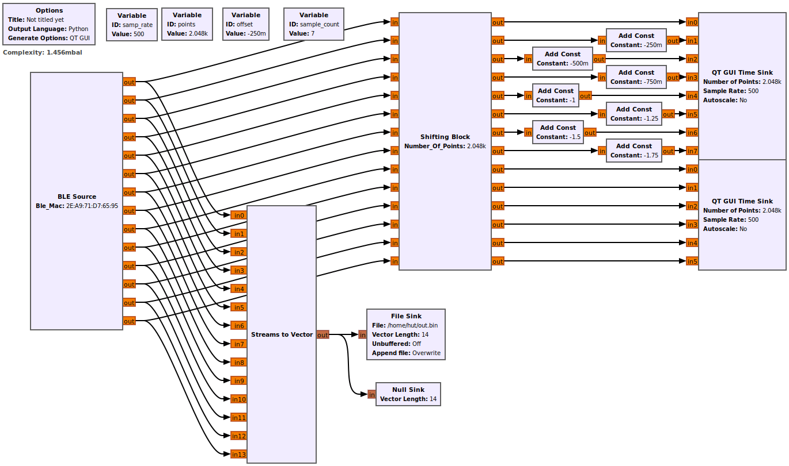
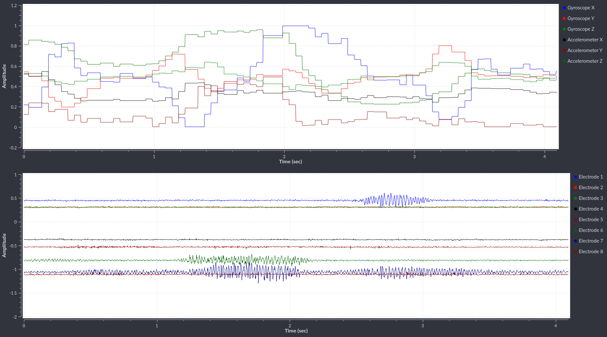

# Unlabeled Samples




- Date: 2023-03-05
- Format: Python Numpy file, Compressed NPZ
- PsyLink Version: [P9.2](https://psylink.me/p9.2)
- Arduino Firmware: [AnalogToBLE 1.1](https://psylink.me/sabt1.1/) [(source code)](https://codeberg.org/psylink/psylink/src/commit/6fcf7106994c005129073e6d00aa8bab947311f1/arduino/AnalogToBLE1.1/AnalogToBLE1.1.ino)
- Recorded with ["plot_signals_and_record.grc"](https://codeberg.org/psylink/psylink/src/commit/6fcf7106994c005129073e6d00aa8bab947311f1/gnuradio/prototype9/plot_signals_and_record.grc) GNURadio script, see screenshot
- Video of sample recording [on PeerTube](https://peertube.linuxrocks.online/w/w9iEcUuub2hAPasKWwjnUd)
- Sample Rate: 500Hz
    - EMG data is updated every tick
    - IMU data (gyroscope, accelerometer) is updated approx. every 25th tick
- Channels: 14
    - 8 EMG Channels
        - 1-4: underside of the forearm
        - 5-8: upside of the forearm
    - 3 Gyroscope Channels (X, Y, Z)
    - 3 Accelerometer Channels (X, Y, Z)
- Samples: 116975 x 14
    - Originally, values between 0 and 255
    - Normalized to floats between 0.0 and 1.0 (by dividing by 256)
    - Steps between possible sample values: 0.00390625 (=1/256)

See [load_recordings.py](load_recordings.py) for a sample script on how to work with these samples.

[Data Sample:](load_recordings.py)

```
EMG0   EMG1   EMG2   EMG3   EMG4   EMG5   EMG6   EMG7   GyrX   GyrY   GyrZ   AccX   AccY   AccZ
0.4492 0.5508 0.8086 0.3867 0.4648 0.4336 0.4492 0.6523 0.4922 0.4805 0.4961 0.3516 0.0195 0.5078
0.4375 0.5508 0.8086 0.3672 0.4648 0.4297 0.4531 0.6484 0.4922 0.4805 0.4961 0.3516 0.0195 0.5078
0.4375 0.5430 0.8164 0.3672 0.4648 0.4336 0.4570 0.6367 0.4922 0.4805 0.4961 0.3516 0.0195 0.5078
0.4453 0.5508 0.8047 0.3711 0.4727 0.4336 0.4492 0.6445 0.4922 0.4805 0.4961 0.3516 0.0195 0.5078
0.4453 0.5469 0.8242 0.3711 0.4688 0.4336 0.4453 0.6367 0.4922 0.4805 0.4961 0.3516 0.0195 0.5078
0.4453 0.5430 0.8164 0.3633 0.4570 0.4336 0.4727 0.6367 0.4922 0.4805 0.4961 0.3516 0.0195 0.5078
0.4570 0.5469 0.8125 0.3633 0.4688 0.4297 0.4531 0.6406 0.4922 0.4805 0.4961 0.3516 0.0195 0.5078
0.4609 0.5508 0.8086 0.3711 0.4570 0.4297 0.4648 0.6406 0.4922 0.4805 0.4961 0.3516 0.0195 0.5078
0.4492 0.5586 0.8164 0.3750 0.4531 0.4336 0.4766 0.6367 0.4922 0.4805 0.4961 0.3516 0.0195 0.5078
0.4492 0.5547 0.8125 0.3594 0.4648 0.4336 0.4609 0.6641 0.4922 0.4805 0.4961 0.3516 0.0195 0.5078
```
