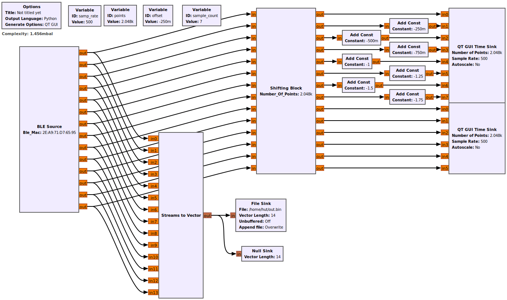

# Unlabeled Samples

- Date: 2023-03-05
- PsyLink Version: [P9.2](https://psylink.me/p9.2)
- Recorded with ["plot_signals_and_record.grc"](https://codeberg.org/psylink/psylink/src/commit/6fcf7106994c005129073e6d00aa8bab947311f1/gnuradio/prototype9/plot_signals_and_record.grc) GNURadio script, see screenshot
- Video of sample recording [on PeerTube](https://peertube.linuxrocks.online/w/w9iEcUuub2hAPasKWwjnUd)
- Sample Rate: 500Hz
- Channels: 14
    - 8 EMG Channels
        - 1-4: underside of the forearm
        - 5-8: upside of the forearm
    - 3 Gyroscope Channels (X, Y, Z)
    - 3 Accelerometer Channels (X, Y, Z)

See `load_recordings.py` for a sample script on how to work with these samples.
